<p align="center"></p>
<p align="center"></p>
<h3 align="center">Showcase your skills on your GitHub or resumé with ease!</h3>
<hr>

# Docs

- [Example](#example)
- [Specifying Icons](#specifying-icons)
- [Themed Icons](#themed-icons)
- [Icons Per Line](#icons-per-line)
- [Centering Icons](#centering-icons)
- [Icons List](#icons-list)

# Example

<p align="center"></p>
<p align="center"></p>

# Specifying Icons

Copy and paste the code block below into your readme to add the skills icon element!

Change the `?i=js,html,css` to a list of your skills separated by ","s! You can find a full list of icons [here](#icons-list).

```md

```


# Themed Icons

Some icons have a dark and light themed background. You can specify which theme you want as a url parameter.

This is optional. The default theme is dark.

Change the `&theme=light` to either `dark` or `light`. The theme is the background color, so light theme has a white icon background, and dark has a black-ish.

**Light Theme Example:**

```md

```


# Icons Per Line

You can specify how many icons you would like per line! It's an optional argument, and the default is 15.

Change the `&perline=3` to any number between 1 and 50.

```md

```


# Get Icons Names

You can get the possiblity to add the name of the icons you put to help others that doesnt know what they are by using `&titles`.

The value of `titles` is a boolean, so it should be `true` or `false`, default is `false`

```md

```


# Centering Icons

Want to center the icons in your readme? The SVGs are automatically resized, so you can do it the same way you'd normally center an image.

```html
<p align="center">
  <a href="https://go-skill-icons.vercel.app/">
    
  </a>
</p>
```

<p align="center">
  <a href="https://go-skill-icons.vercel.app/">
    
  </a>
</p>

# Icons List

Here's a list of all the icons currently supported. Feel free to open an issue to suggest icons to add!

|      Icon ID        |                          Icon                           |
| :-----------------: | :-----------------------------------------------------: |
|       `ableton`     |      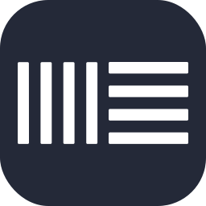    |
|       `acrobat`     |               |
|    `activitypub`    |   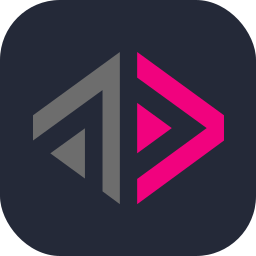   |
|       `actix`       |      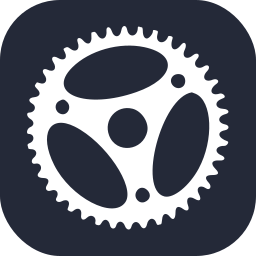      |
|       `adonis`      |                |
|         `ar`        |                  |
|         `ae`        |          |
|      `aiscript`     |    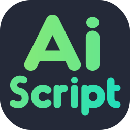     |
|      `alpinejs`     |    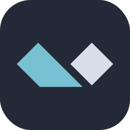     |
|      `anaconda`     |         |
|   `androidstudio`   |  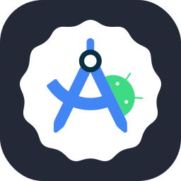  |
|      `angular`      |     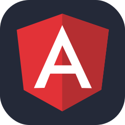     |
|         `an`        |               |
|      `ansible`      |               |
|        `anss`       |       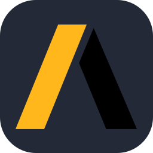      |
|       `apollo`      |                |
|       `apple`       |            |
|      `appwrite`     |              |
|        `arch`       |      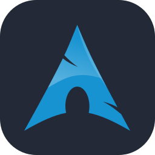       |
|      `arduino`      |               |
|        `asm`        |              |
|       `astro`       |                 |
|        `atom`       |                  |
|         `au`        |              |
|      `autocad`      |          |
|        `aws`        |              |
|        `azul`       |                  |
|       `azure`       |            |
|       `babel`       |                 |
|        `bash`       |             |
|         `be`        |               |
|        `bevy`       |      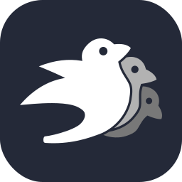       |
|     `bitbucket`     |        |
|      `blender`      |          |
|     `bootstrap`     |             |
|       `brave`       |            |
|         `br`        |                |
|        `bsd`        |              |
|        `bun`        |              |
|         `c`         |                     |
|         `ca`        |               |
|         `cs`        |                    |
|        `cpp`        |                   |
|         `cc`        |         |
|      `crystal`      |     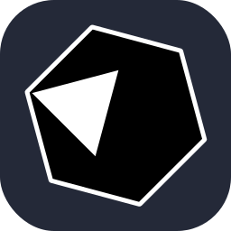     |
|     `cassandra`     |    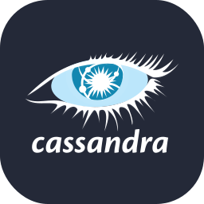    |
|         `ch`        |     |
|       `chrome`      |           |
|      `chromium`     |      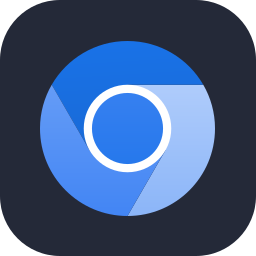   |
|       `clion`       |      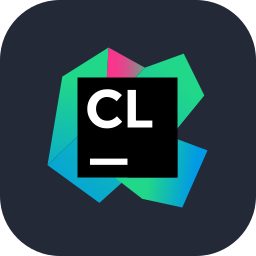      |
|      `clojure`      |          |
|     `cloudflare`    |       |
|       `cmake`       |      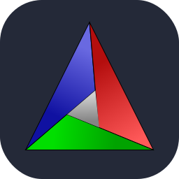      |
|      `codepen`      |     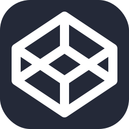     |
|    `coffeescript`   |     |
|        `css`        |                   |
|      `cypress`      |          |
|         `d3`        |       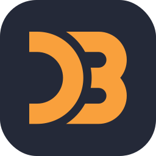        |
|        `dart`       |             |
|       `debian`      |     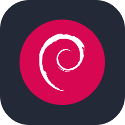      |
|      `defold`       |     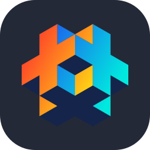      |
|        `deno`       |      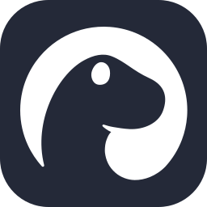       |
|       `devto`       |      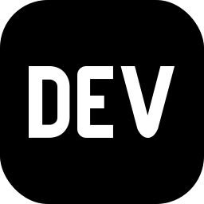      |
|         `dn`        |             |
|      `discord`      |               |
|        `bots`       |           |
|     `discordjs`     |        |
|       `django`      |                |
|       `docker`      |                |
|      `docksal`      |     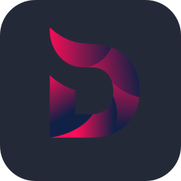     |
|       `dotnet`      |                |
|         `dw`        |           |
|       `drupal`      |      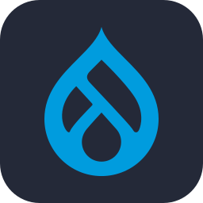     |
|      `dynamodb`     |    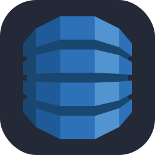     |
|      `eclipse`      |          |
|        `edge`       |       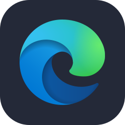      |
|   `elasticsearch`   |  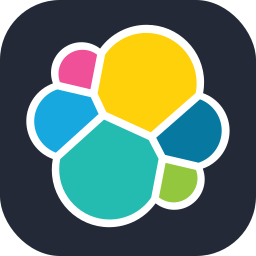  |
|      `electron`     |              |
|       `elixir`      |     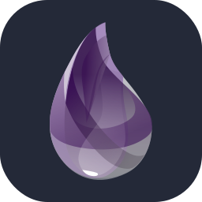      |
|       `elysia`      |     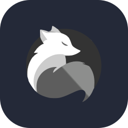      |
|       `emacs`       |                 |
|       `ember`       |                 |
|      `emotion`      |          |
|       `excel`       |     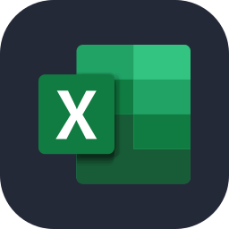       |
|      `express`      |        |
|      `fastapi`      |               |
|     `fediverse`     |    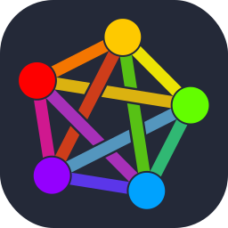    |
|       `figma`       |            |
|      `firebase`     |    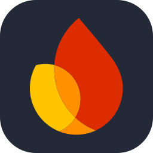     |
|      `firefox`      |          |
|       `flask`       |            |
|      `flutter`      |          |
|       `fonts`       |                 |
|       `forth`       |                 |
|      `fortran`      |               |
|       `fresco`      |                |
|        `fuse`       |                  |
|  `gamemakerstudio`  |       |
|       `gatsby`      |                |
|        `gcp`        |              |
|        `git`        |         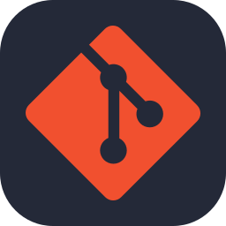     |
|       `github`      |           |
|   `githubactions`   |    |
|       `gitlab`      |     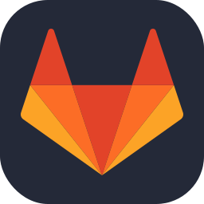      |
|       `gmail`       |            |
|       `gleam`       |            |
|      `gherkin`      |          |
|         `go`        |                |
|  `googleanalytics`  | 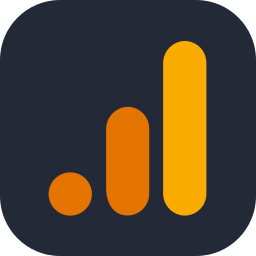 |
| `googleappsscript`  | |
|       `gradle`      |           |
|       `godot`       |            |
|      `grafana`      |          |
|      `graphql`      |          |
|        `gtk`        |              |
|        `gulp`       |                  |
|      `haskell`      |     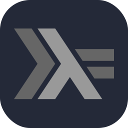     |
|        `haxe`       |             |
|     `haxeflixel`    |       |
|       `helix`       |       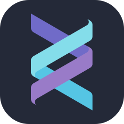     |
|       `heroku`      |                |
|     `hibernate`     |        |
|        `html`       |                  |
|        `htmx`       |      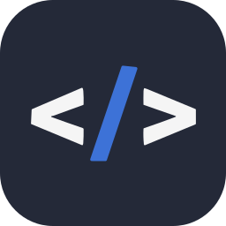       |
|      `hydrogen`     |      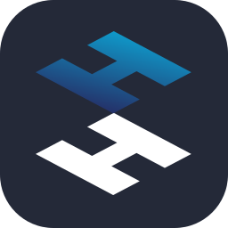   |
|        `idea`       |             |
|         `ai`        |           |
|         `ic`        |                |
|         `id`        |              |
|     `instagram`     |             |
|        `ipfs`       |      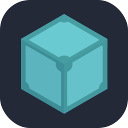       |
|        `java`       |             |
|         `js`        |            |
|      `jenkins`      |          |
|        `jest`       |                  |
|       `jquery`      |                |
|       `julia`       |        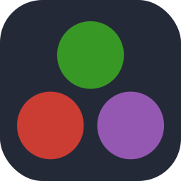    |
|      `kakoune`      |       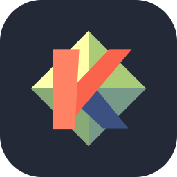   |
|       `kafka`       |                 |
|        `kali`       |      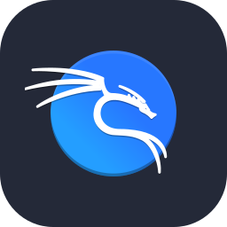       |
|       `kotlin`      |     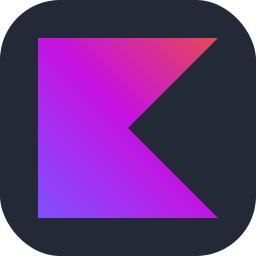      |
|        `ktor`       |             |
|     `kubernetes`    |            |
|      `laravel`      |          |
|       `latex`       |      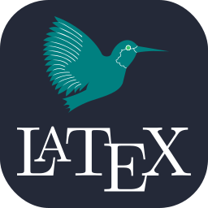      |
|      `leetcode`     |         |
|        `less`       |             |
|         `lr`        |             |
|         `lrc`       |      |
|      `linkedin`     |              |
|       `linux`       |            |
|        `lit`        |              |
|       `litmus`      |       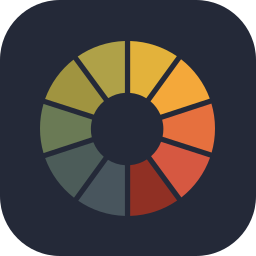    |
|       `looker`      |           |
|        `lua`        |              |
|         `md`        |         |
|      `mastodon`     |         |
|     `materialui`    |       |
|       `matlab`      |     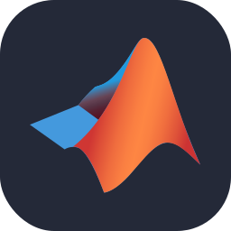      |
|     `matplotlib`    |    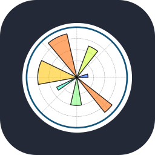   |
|       `maven`       |      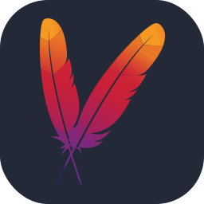      |
|         `me`        |          |
|      `million`      |    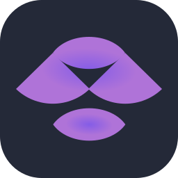    |
|        `mint`       |             |
|      `misskey`      |          |
|        `mjml`       |        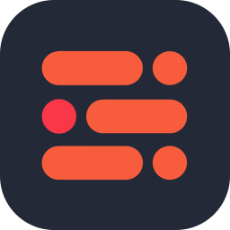     |
|        `ml5`        |              |
|      `mongodb`      |               |
|       `mysql`       |            |
|       `neovim`      |           |
|       `nestjs`      |           |
|      `netlify`      |          |
|       `nextjs`      |           |
|       `nginx`       |                 |
|        `nim`        |              |
|        `nix`        |              |
|       `nodejs`      |           |
|       `notion`      |           |
|        `npm`        |              |
|        `numpy`      |            |
|       `nuxtjs`      |           |
|      `obsidian`     |         |
|       `ocaml`       |                 |
|       `octave`      |           |
|      `onedrive`     |         |
|       `onenote`     |          |
|       `opencv`      |           |
|     `openshift`     |             |
|     `openstack`     |        |
|       `opera`       |            |
|       `outlook`     |            |
|        `p5js`       |                  |
|       `pandas`      |           |
|        `pbi`        |              |
|        `perl`       |                  |
|         `ps`        |             |
|        `psc`        |      |
|        `psx`        |      |
|        `php`        |              |
|      `phpstorm`     |         |
|       `pinia`       |            |
|        `pkl`        |              |
|       `plan9`       |            |
|    `planetscale`    |      |
|        `pnpm`       |             |
|     `pocketbase`    |       |
|         `pf`        |             |
|      `postgres`     |       |
|      `postman`      |               |
|     `powerpoint`    |       |
|     `powershell`    |       |
|       `preact`      |           |
|         `pl`        |               |
|         `pr`        |              |
|         `ru`        |          |
|       `prisma`      |                |
|     `processing`    |       |
|     `prometheus`    |            |
|        `pug`        |              |
|      `pupeteer`     |         |
|      `pycharm`      |          |
|         `py`        |           |
|      `pytorch`      |          |
|         `qt`        |               |
|         `r`         |                |
|      `rabbitmq`     |         |
|       `rails`       |                 |
|    `raspberrypi`    |      |
|       `react`       |            |
|     `reactivex`     |        |
|       `redhat`      |           |
|       `redis`       |            |
|       `redux`       |                 |
|       `regex`       |            |
|       `remix`       |            |
|       `replit`      |           |
|       `rider`       |            |
|    `robloxstudio`   |          |
|       `rocket`      |                |
|      `rollupjs`     |         |
|        `ros`        |              |
|        `ruby`       |                  |
|        `rust`       |             |
|      `safari`       |           |
|        `sass`       |                  |
|       `spring`      |           |
|       `sqlite`      |                |
|      `sqlserver`    |        |
|   `stackoverflow`   |    |
|       `stock`       |                 |
|  `styledcomponents` |      |
|      `sublime`      |          |
|      `supabase`     |         |
|     `surrealdb`     |        |
|       `scala`       |            |
|        `scipy`      |            |
|      `scratch`      |               |
|      `sklearn`      |      |
|      `selenium`     |              |
|       `sentry`      |                |
|     `sequelize`     |        |
|    `sharepoint`     |       |
|      `shopify`      |          |
|      `sketchup`     |         |
|      `solidity`     |              |
|      `solidjs`      |          |
|       `spark`       |                 |
|       `svelte`      |                |
|        `svg`        |              |
|       `swift`       |                 |
|      `symfony`      |          |
|      `tableau`      |          |
|      `tailwind`     |      |
|       `tauri`       |            |
|       `teams`       |            |
|     `tensorflow`    |       |
|     `terraform`     |        |
|      `threejs`      |          |
|        `tor`        |              |
|      `twitter`      |               |
|         `ts`        |            |
|       `ubuntu`      |           |
|       `unity`       |            |
|       `unreal`      |          |
|         `v`         |                |
|        `vala`       |                  |
|         `vb`        |      |
|       `vercel`      |           |
|        `vim`        |              |
|    `visualstudio`   |     |
|        `vite`       |             |
|       `vitest`      |           |
|       `vscode`      |           |
|      `vscodium`     |         |
|        `vue`        |            |
|      `vuetify`      |          |
|        `wasm`       |           |
|      `webflow`      |               |
|      `webpack`      |          |
|      `webstorm`     |         |
|      `windicss`     |         |
|      `windows`      |          |
|        `word`       |             |
|     `wordpress`     |             |
|      `workers`      |          |
|       `xcode`       |            |
|         `xd`        |                    |
|       `yammer`      |           |
|        `yarn`       |             |
|        `yew`        |              |
|        `zed`        |              |
|        `zig`        |              |

---

## 💖 Support the Project

Thank you so much already for using my projects!

To support the project directly, feel free to open issues for icon suggestions, or contribute with a pull request!
