<p align="center"></p>
<p align="center"></p>
<h3 align="center">Showcase your skills on your GitHub or resumé with ease!</h3>
<hr>

# Docs

- [Docs](#docs)
- [Example](#example)
- [Specifying Icons](#specifying-icons)
- [Themed Icons](#themed-icons)
- [Icons Per Line](#icons-per-line)
- [Get Icons Names](#get-icons-names)
- [Centering Icons](#centering-icons)
- [Icons List](#icons-list)
- [💖 Support the Project](#-support-the-project)

# Example

<p align="center"></p>
<p align="center"></p>

# Specifying Icons

Copy and paste the code block below into your readme to add the skills icon element!

Change the `?i=js,html,css` to a list of your skills separated by ","s! You can find a full list of icons [here](#icons-list).

```md

```


# Themed Icons

Some icons have a dark and light themed background. You can specify which theme you want as a url parameter.

This is optional. The default theme is dark.

Change the `&theme=light` to either `dark` or `light`. The theme is the background color, so light theme has a white icon background, and dark has a black-ish.

**Light Theme Example:**

```md

```


# Icons Per Line

You can specify how many icons you would like per line! It's an optional argument, and the default is 15.

Change the `&perline=3` to any number between 1 and 50.

```md

```


# Get Icons Names

You can get the possiblity to add the name of the icons you put to help others that doesnt know what they are by using `&titles`.

The value of `titles` is a boolean, so it should be `true` or `false`, default is `false`

```md

```


# Centering Icons

Want to center the icons in your readme? The SVGs are automatically resized, so you can do it the same way you'd normally center an image.

```html
<p align="center">
  <a href="https://go-skill-icons.vercel.app/">
    
  </a>
</p>
```

<p align="center">
  <a href="https://go-skill-icons.vercel.app/">
    
  </a>
</p>

# Icons List

| Icon ID | Icon | Icon ID | Icon | Icon ID | Icon | Icon ID | Icon | Icon ID | Icon | Icon ID | Icon | Icon ID | Icon | Icon ID | Icon | Icon ID | Icon | Icon ID | Icon | Icon ID | Icon | Icon ID | Icon | Icon ID | Icon | Icon ID | Icon | Icon ID | Icon |
| :-----------------: | :--------------: | :-----------------: | :--------------: | :-----------------: | :--------------: | :-----------------: | :--------------: | :-----------------: | :--------------: | :-----------------: | :--------------: | :-----------------: | :--------------: | :-----------------: | :--------------: | :-----------------: | :--------------: | :-----------------: | :--------------: | :-----------------: | :--------------: | :-----------------: | :--------------: | :-----------------: | :--------------: | :-----------------: | :--------------: | :-----------------: | :--------------: |
|          `ableton`           |          |         `bash-dark`          |             |      `cloudflare-light`      |      |        `drizzle-dark`        |          |          `forgejo`           |          |         `grpc-light`         |            |       `jenkins-light`        |         |         `logto-dark`         |            |          `nim-dark`          |              |       `picocss-light`        |         |        `qdrant-light`        |          |          `s3-light`          |              |           `stylus`           |           |           `vapor`            |                 |         `yii-light`          |             |
|        `ableton-dark`        |          |         `bash-light`         |            |           `cmake`            |            |       `drizzle-light`        |         |        `forgejo-dark`        |          |           `grunt`            |            |            `jest`            |                |        `logto-light`         |           |         `nim-light`          |             |          `pinecone`          |         |           `qodana`           |           |           `safari`           |           |        `stylus-dark`         |           |           `vercel`           |           |          `youtube`           |               |
|       `ableton-light`        |         |         `beeceptor`          |    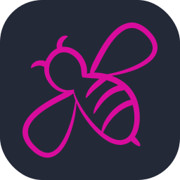    |         `cmake-dark`         |            |           `drupal`           |           |       `forgejo-light`        |         |         `grunt-dark`         |            |       `jetpackcompose`       |   |           `looker`           |           |           `nixos`            |            |       `pinecone-dark`        |         |        `qodana-dark`         |           |        `safari-dark`         |           |        `stylus-light`        |          |        `vercel-dark`         |           |           `zabbix`           |              |
|          `acrobat`           |               |       `beeceptor-dark`       |        |        `cmake-light`         |           |        `drupal-dark`         |           |           `forth`            |                 |        `grunt-light`         |           |    `jetpackcompose-dark`     |   |        `looker-dark`         |           |         `nixos-dark`         |            |       `pinecone-light`       |        |        `qodana-light`        |          |        `safari-light`        |          |          `sublime`           |          |        `vercel-light`        |          |            `zed`             |              |
|        `activitypub`         |      |      `beeceptor-light`       |       |        `cockroachdb`         |      |        `drupal-light`        |          |          `fortran`           |               |            `gsap`            |             |    `jetpackcompose-light`    |  |        `looker-light`        |          |        `nixos-light`         |           |         `pinescript`         |       |             `qt`             |               |            `sail`            |                |        `sublime-dark`        |          |            `vim`             |              |          `zed-dark`          |              |
|      `activitypub-dark`      |      |          `behance`           |               |      `cockroachdb-dark`      |      |         `duckduckgo`         |            |         `frankenphp`         |       |         `gsap-dark`          |             |         `jetstream`          |             |            `lua`             |              |           `nodejs`           |           |      `pinescript-dark`       |       |          `qt-dark`           |               |          `sanctum`           |               |       `sublime-light`        |         |          `vim-dark`          |              |         `zed-light`          |             |
|     `activitypub-light`      |     |           `behat`            |            |     `cockroachdb-light`      |     |            `dusk`            |                |      `frankenphp-dark`       |       |         `gsap-light`         |            |            `jira`            |             |          `lua-dark`          |              |        `nodejs-dark`         |           |      `pinescript-light`      |      |          `qt-light`          |              |            `sas`             |              |          `supabase`          |         |         `vim-light`          |             |           `zellij`           |           |
|           `actix`            |            |         `behat-dark`         |            |          `codeberg`          |         |          `dynamodb`          |         |      `frankenphp-light`      |      |            `gtk`             |              |         `jira-dark`          |             |         `lua-light`          |             |        `nodejs-light`        |          |           `pinia`            |            |          `quarkus`           |     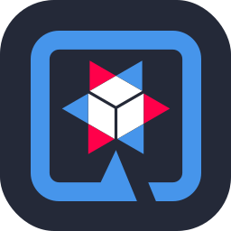     |          `sas-dark`          |              |       `supabase-dark`        |         |         `virtualbox`         |       |        `zellij-dark`         |     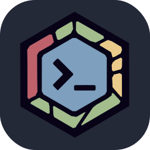      |
|         `actix-dark`         |            |        `behat-light`         |           |       `codeberg-dark`        |         |       `dynamodb-dark`        |         |           `fresco`           |              |          `gtk-dark`          |              |         `jira-light`         |            |            `luau`            |                |         `notepadpp`          |        |         `pinia-dark`         |            |        `quarkus-dark`        |     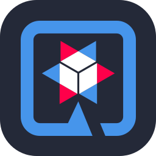     |         `sas-light`          |             |       `supabase-light`       |        |      `virtualbox-dark`       |       |        `zellij-light`        |     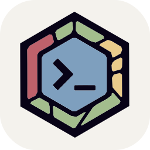     |
|        `actix-light`         |           |            `bevy`            |      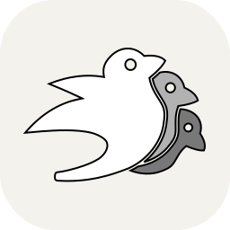       |       `codeberg-light`       |        |       `dynamodb-light`       |        |           `fresh`            |            |         `gtk-light`          |             |           `joomla`           |           |         `lucidchart`         |       |       `notepadpp-dark`       |        |        `pinia-light`         |           |       `quarkus-light`        |         |            `sass`            |                |         `surrealdb`          |        |      `virtualbox-light`      |      |            `zen`             |       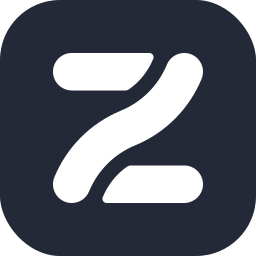       |
|         `adobespark`         |            |         `bevy-dark`          |             |        `codeigniter`         |      |            `echo`            |                |         `fresh-dark`         |            |            `gulp`            |                |        `joomla-dark`         |           |      `lucidchart-dark`       |       |      `notepadpp-light`       |       |            `pint`            |                |             `r`              |              |           `scala`            |            |       `surrealdb-dark`       |        |        `visualbasic`         |   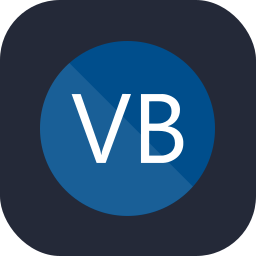   |          `zen-dark`          |       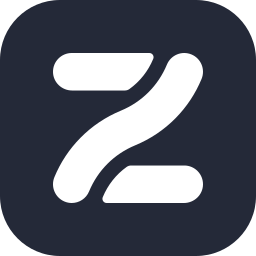       |
|           `adonis`           |              |         `bevy-light`         |      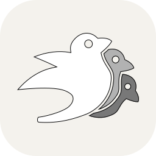      |      `codeigniter-dark`      |      |          `eclipse`           |          |        `fresh-light`         |           |           `hadoop`           |           |        `joomla-light`        |          |      `lucidchart-light`      |      |           `notion`           |           |            `pkl`             |              |           `r-dark`           |              |         `scala-dark`         |            |      `surrealdb-light`       |       |      `visualbasic-dark`      |      |         `zen-light`          |      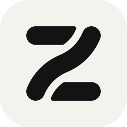       |
|            `aero`            |                |          `bigquery`          |         |     `codeigniter-light`      |     |        `eclipse-dark`        |          |            `fuse`            |                |        `hadoop-dark`         |           |           `jquery`           |              |           `lunacy`           |              |        `notion-dark`         |           |          `pkl-dark`          |              |          `r-light`           |               |        `scala-light`         |           |           `svelte`           |              |     `visualbasic-light`      |     |            `zig`             |              |
|        `aftereffects`        |          |       `bigquery-dark`        |         |          `codepen`           |          |       `eclipse-light`        |         |      `gamemakerstudio`       |       |        `hadoop-light`        |          |           `julia`            |            |            `lxc`             |              |        `notion-light`        |          |         `pkl-light`          |             |          `rabbitmq`          |         |        `scikitlearn`         |      |            `svg`             |              |        `visualstudio`        |     |          `zig-dark`          |              |
|          `aiscript`          |         |       `bigquery-light`       |        |        `codepen-dark`        |          |            `edge`            |             |          `ganache`           |          |          `hardhat`           |          |         `julia-dark`         |            |          `lxc-dark`          |       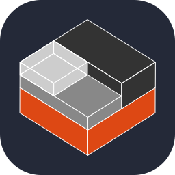       |            `nova`            |                |           `plan9`            |            |       `rabbitmq-dark`        |         |      `scikitlearn-dark`      |      |          `svg-dark`          |              |     `visualstudio-dark`      |     |         `zig-light`          |             |
|       `aiscript-dark`        |         |         `bitbucket`          |        |       `codepen-light`        |         |         `edge-dark`          |             |        `ganache-dark`        |          |        `hardhat-dark`        |          |        `julia-light`         |           |         `lxc-light`          |      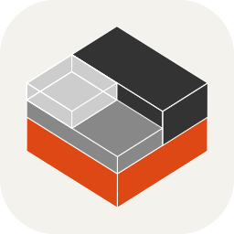       |            `npm`             |              |         `plan9-dark`         |            |       `rabbitmq-light`       |        |     `scikitlearn-light`      |     |         `svg-light`          |             |     `visualstudio-light`     |    |           `zudoku`           |           |
|       `aiscript-light`       |        |       `bitbucket-dark`       |        |        `coffeescript`        |     |         `edge-light`         |            |       `ganache-light`        |         |       `hardhat-light`        |         |          `jupyter`           |          |          `manjaro`           |               |          `npm-dark`          |              |        `plan9-light`         |           |           `rails`            |                 |           `scipy`            |            |            `svn`             |         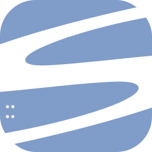          |            `vite`            |             |        `zudoku-dark`         |           |
|         `alacritty`          |    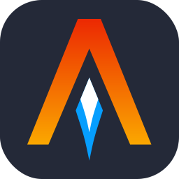    |      `bitbucket-light`       |       |     `coffeescript-dark`      |     |       `elasticsearch`        |    |           `gatsby`           |              |          `haskell`           |          |        `jupyter-dark`        |     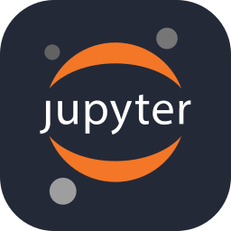     |          `mariadb`           |          |         `npm-light`          |             |        `planetscale`         |      |          `railway`           |          |         `scipy-dark`         |            |          `swagger`           |          |         `vite-dark`          |             |        `zudoku-light`        |          |
|       `alacritty-dark`       |        |           `blazor`           |           |     `coffeescript-light`     |    |     `elasticsearch-dark`     |    |            `gcp`             |              |        `haskell-dark`        |          |       `jupyter-light`        |    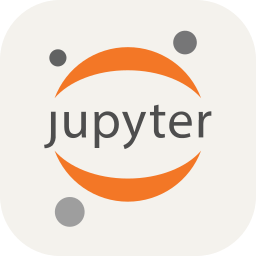     |        `mariadb-dark`        |          |           `numpy`            |            |      `planetscale-dark`      |      |        `railway-dark`        |          |        `scipy-light`         |           |        `swagger-dark`        |          |         `vite-light`         |            |          `zustand`           |          |
|      `alacritty-light`       |       |        `blazor-dark`         |           |       `commercetools`        |    |    `elasticsearch-light`     |   |          `gcp-dark`          |              |       `haskell-light`        |         |           `kafka`            |                 |       `mariadb-light`        |         |         `numpy-dark`         |            |     `planetscale-light`      |     |       `railway-light`        |         |           `scout`            |                 |       `swagger-light`        |         |           `vitest`           |           |        `zustand-dark`        |          |
|          `alchemy`           |          |        `blazor-light`        |          |     `commercetools-dark`     |    |          `electron`          |              |         `gcp-light`          |             |            `haxe`            |             |           `kaggle`           |           |          `markdown`          |         |        `numpy-light`         |           |         `platformio`         |       |        `raspberrypi`         |      |          `scratch`           |               |           `swift`            |                 |        `vitest-dark`         |           |       `zustand-light`        |         |
|        `alchemy-dark`        |          |          `blender`           |          |    `commercetools-light`     |   |        `elementplus`         |      |          `gdevelop`          |         |         `haxe-dark`          |             |        `kaggle-dark`         |           |       `markdown-dark`        |         |           `nuxtjs`           |           |      `platformio-dark`       |       |      `raspberrypi-dark`      |      |          `seaborn`           |          |          `symfony`           |          |        `vitest-light`        |          |
|       `alchemy-light`        |         |        `blender-dark`        |          |          `composer`          |         |      `elementplus-dark`      |   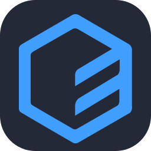   |       `gdevelop-dark`        |         |         `haxe-light`         |            |        `kaggle-light`        |          |       `markdown-light`       |        |        `nuxtjs-dark`         |           |      `platformio-light`      |      |     `raspberrypi-light`      |     |        `seaborn-dark`        |          |        `symfony-dark`        |          |     `vmwareworkstation`      ||
|          `alpinejs`          |         |       `blender-light`        |         |       `composer-dark`        |         |     `elementplus-light`      |     |       `gdevelop-light`       |        |         `haxeflixel`         |       |          `kakoune`           |          |          `mastodon`          |         |        `nuxtjs-light`        |          |         `playwright`         |       |           `react`            |            |       `seaborn-light`        |         |       `symfony-light`        |         |   `vmwareworkstation-dark`   ||
|       `alpinejs-dark`        |         |          `bluesky`           |          |       `composer-light`       |        |           `elixir`           |           |           `gemini`           |           |      `haxeflixel-dark`       |       |        `kakoune-dark`        |          |       `mastodon-dark`        |         |          `obsidian`          |         |      `playwright-dark`       |       |         `react-dark`         |            |          `selenium`          |              |          `tableau`           |          |  `vmwareworkstation-light`   |   |
|       `alpinejs-light`       |        |        `bluesky-dark`        |          |         `contentful`         |       |        `elixir-dark`         |           |        `gemini-dark`         |           |      `haxeflixel-light`      |      |       `kakoune-light`        |         |       `mastodon-light`       |        |       `obsidian-dark`        |         |      `playwright-light`      |      |        `react-light`         |           |           `sentry`           |              |        `tableau-dark`        |          |           `vscode`           |           |
|          `anaconda`          |         |       `bluesky-light`        |         |      `contentful-dark`       |       |        `elixir-light`        |          |        `gemini-light`        |          |           `helix`            |            |            `kali`            |             |         `materialui`         |       |       `obsidian-light`       |        |           `plsql`            |            |       `reactbootstrap`       |   |         `sequelize`          |        |       `tableau-light`        |         |        `vscode-dark`         |           |
|       `anaconda-dark`        |         |           `bokeh`            |            |      `contentful-light`      |      |            `elm`             |              |           `gentoo`           |           |         `helix-dark`         |            |         `kali-dark`          |             |      `materialui-dark`       |       |           `ocaml`            |                 |         `plsql-dark`         |            |    `reactbootstrap-dark`     |   |       `sequelize-dark`       |        |        `tailwindcss`         |      |        `vscode-light`        |          |
|       `anaconda-light`       |        |         `bokeh-dark`         |            |            `cpp`             |                   |          `elm-dark`          |              |        `gentoo-dark`         |           |        `helix-light`         |           |         `kali-light`         |            |      `materialui-light`      |      |           `octane`           |              |        `plsql-light`         |           |    `reactbootstrap-light`    |  |      `sequelize-light`       |       |      `tailwindcss-dark`      |      |          `vscodium`          |         |
|          `android`           |          |        `bokeh-light`         |           |       `creativecloud`        |         |         `elm-light`          |             |        `gentoo-light`        |          |            `helm`            |             |           `karma`            |            |           `matlab`           |           |           `octave`           |           |            `pm2`             |              |         `reactivex`          |        |           `shadcn`           |           |     `tailwindcss-light`      |     |       `vscodium-dark`        |         |
|        `android-dark`        |          |         `bootstrap`          |             |          `crystal`           |          |           `elysia`           |           |          `gherkin`           |          |         `helm-dark`          |             |         `karma-dark`         |            |        `matlab-dark`         |           |        `octave-dark`         |           |          `pm2-dark`          |              |       `reactivex-dark`       |        |        `shadcn-dark`         |           |         `tallyprime`         |            |       `vscodium-light`       |        |
|       `android-light`        |         |           `brave`            |            |        `crystal-dark`        |          |        `elysia-dark`         |           |        `gherkin-dark`        |          |         `helm-light`         |            |        `karma-light`         |           |        `matlab-light`        |          |        `octave-light`        |          |         `pm2-light`          |             |      `reactivex-light`       |       |        `shadcn-light`        |          |           `tauri`            |            |           `vuejs`            |            |
|       `androidstudio`        |    |         `brave-dark`         |            |       `crystal-light`        |         |        `elysia-light`        |          |       `gherkin-light`        |         |            `herd`            |                |            `kde`             |              |         `matplotlib`         |       |            `odin`            |             |            `pnpm`            |             |        `reactnative`         |      |         `sharepoint`         |       |         `tauri-dark`         |            |         `vuejs-dark`         |            |
|     `androidstudio-dark`     |    |        `brave-light`         |           |             `cs`             |                  |           `emacs`            |                 |            `gimp`            |             |           `heroku`           |              |          `kde-dark`          |              |      `matplotlib-dark`       |       |         `odin-dark`          |             |         `pnpm-dark`          |             |      `reactnative-dark`      |      |      `sharepoint-dark`       |       |        `tauri-light`         |           |        `vuejs-light`         |           |
|    `androidstudio-light`     |   |           `breeze`           |              |            `css`             |                   |           `ember`            |                 |         `gimp-dark`          |             |         `hibernate`          |        |         `kde-light`          |             |      `matplotlib-light`      |      |         `odin-light`         |            |         `pnpm-light`         |            |     `reactnative-light`      |     |      `sharepoint-light`      |      |           `teams`            |            |          `vuetify`           |          |
|          `angular`           |          |           `bridge`           |              |            `cuda`            |             |          `emotion`           |          |         `gimp-light`         |            |       `hibernate-dark`       |        |          `keycloak`          |              |           `maven`            |            |           `ollama`           |           |         `pocketbase`         |       |          `reactos`           |          |          `shopify`           |          |         `teams-dark`         |            |        `vuetify-dark`        |          |
|        `angular-dark`        |          |            `bsd`             |              |         `cuda-dark`          |             |        `emotion-dark`        |          |            `gin`             |       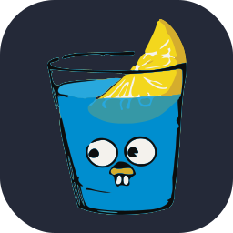       |      `hibernate-light`       |       |           `keydb`            |            |         `maven-dark`         |            |        `ollama-dark`         |           |      `pocketbase-dark`       |       |        `reactos-dark`        |          |        `shopify-dark`        |          |        `teams-light`         |           |       `vuetify-light`        |         |
|       `angular-light`        |         |          `bsd-dark`          |              |         `cuda-light`         |            |       `emotion-light`        |         |          `gin-dark`          |              |           `holyc`            |                 |         `keydb-dark`         |            |        `maven-light`         |           |        `ollama-light`        |          |      `pocketbase-light`      |      |       `reactos-light`        |         |       `shopify-light`        |         |          `telegram`          |              |           `vyper`            |            |
|          `animate`           |               |         `bsd-light`          |             |          `cypress`           |          |          `envoyer`           |               |         `gin-light`          |      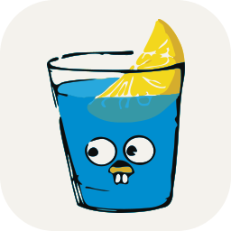       |            `hono`            |             |        `keydb-light`         |     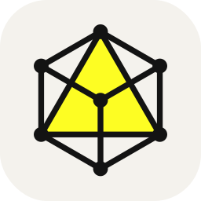      |        `mediaencoder`        |          |          `onedrive`          |         |           `podman`           |           |         `reactquery`         |       |           `signal`           |              |         `telescope`          |             |         `vyper-dark`         |            |
|          `ansible`           |               |            `btlo`            |             |        `cypress-dark`        |          |           `erlang`           |           |            `git`             |              |         `hono-dark`          |             |           `kibana`           |           |          `mermaid`           |               |       `onedrive-dark`        |         |        `podman-dark`         |           |      `reactquery-dark`       |       |         `skeletonui`         |       |         `tensorflow`         |       |        `vyper-light`         |           |
|            `anss`            |             |         `btlo-dark`          |             |       `cypress-light`        |         |        `erlang-dark`         |           |          `git-dark`          |              |         `hono-light`         |            |        `kibana-dark`         |     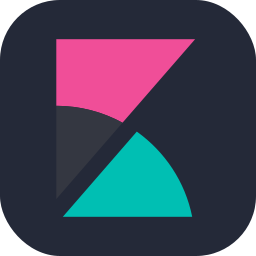      |          `metabase`          |         |       `onedrive-light`       |        |        `podman-light`        |          |      `reactquery-light`      |      |      `skeletonui-dark`       |       |      `tensorflow-dark`       |       |           `wails`            |            |
|         `anss-dark`          |             |         `btlo-light`         |            |             `d`              |                     |        `erlang-light`        |          |         `git-light`          |             |          `horizon`           |               |        `kibana-light`        |     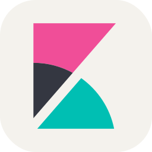     |       `metabase-dark`        |         |          `onenote`           |          |           `popos`            |                 |           `recoil`           |              |      `skeletonui-light`      |      |      `tensorflow-light`      |      |         `wails-dark`         |            |
|         `anss-light`         |            |           `bulma`            |            |             `d3`             |               |            `etcd`            |             |           `gitea`            |            |            `html`            |                |           `kitty`            |            |       `metabase-light`       |        |        `onenote-dark`        |          |         `portfolio`          |             |           `redhat`           |           |          `sketchup`          |         |          `terminal`          |         |        `wails-light`         |           |
|            `api`             |              |         `bulma-dark`         |            |          `d3-dark`           |               |         `etcd-dark`          |             |         `gitea-dark`         |            |            `htmx`            |             |         `kitty-dark`         |            |          `meteorjs`          |         |       `onenote-light`        |         |         `postgresql`         |       |        `redhat-dark`         |           |       `sketchup-dark`        |         |       `terminal-dark`        |         |           `wandb`            |            |
|          `api-dark`          |              |        `bulma-light`         |           |          `d3-light`          |              |         `etcd-light`         |            |        `gitea-light`         |           |         `htmx-dark`          |             |        `kitty-light`         |           |       `meteorjs-dark`        |         |           `opencv`           |           |      `postgresql-dark`       |       |        `redhat-light`        |          |       `sketchup-light`       |        |       `terminal-light`       |        |         `wandb-dark`         |            |
|         `api-light`          |             |            `bun`             |              |          `dailydev`          |         |           `excel`            |            |           `github`           |           |         `htmx-light`         |            |           `kotlin`           |           |       `meteorjs-light`       |        |        `opencv-dark`         |           |      `postgresql-light`      |      |           `redis`            |            |           `slack`            |            |         `terraform`          |        |        `wandb-light`         |           |
|           `apidog`           |           |          `bun-dark`          |              |       `dailydev-dark`        |         |         `excel-dark`         |            |        `github-dark`         |           |            `htop`            |             |        `kotlin-dark`         |           |      `microsoftcopilot`      | |        `opencv-light`        |          |          `postman`           |               |         `redis-dark`         |            |         `slack-dark`         |            |       `terraform-dark`       |        |            `warp`            |             |
|        `apidog-dark`         |           |         `bun-light`          |             |       `dailydev-light`       |        |        `excel-light`         |           |        `github-light`        |          |         `htop-dark`          |             |        `kotlin-light`        |          |   `microsoftcopilot-dark`    | |           `openmm`           |           |         `powerpoint`         |       |        `redis-light`         |           |        `slack-light`         |           |      `terraform-light`       |       |         `warp-dark`          |             |
|        `apidog-light`        |          |             `c`              |                     |          `daisyui`           |          |            `expo`            |             |       `githubactions`        |  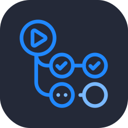  |         `htop-light`         |            |            `ktor`            |             |   `microsoftcopilot-light`   ||        `openmm-dark`         |           |      `powerpoint-dark`       |       |          `redshift`          |         |         `snowflake`          |    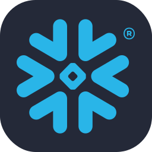    |       `testinglibrary`       |   |         `warp-light`         |            |
|           `apollo`           |              |          `cachyos`           |          |        `daisyui-dark`        |          |         `expo-dark`          |             |     `githubactions-dark`     |    |        `huggingface`         |      |         `ktor-dark`          |             |         `millionjs`          |        |        `openmm-light`        |          |      `powerpoint-light`      |      |       `redshift-dark`        |         |       `snowflake-dark`       |        |    `testinglibrary-dark`     |   |        `webassembly`         |           |
|          `appcode`           |          |        `cachyos-dark`        |          |       `daisyui-light`        |         |         `expo-light`         |            |    `githubactions-light`     |   |      `huggingface-dark`      |      |         `ktor-light`         |            |       `millionjs-dark`       |        |         `openshift`          |             |         `powershell`         |       |       `redshift-light`       |        |      `snowflake-light`       |       |    `testinglibrary-light`    |  |          `webflow`           |               |
|        `appcode-dark`        |          |       `cachyos-light`        |         |            `dart`            |             |         `expressjs`          |        |       `githubcopilot`        |    |     `huggingface-light`      |     |         `kubernetes`         |            |      `millionjs-light`       |       |         `opensource`         |       |      `powershell-dark`       |       |           `redux`            |                 |            `snyk`            |             |          `threejs`           |          |          `webpack`           |          |
|       `appcode-light`        |         |           `caddy`            |            |         `dart-dark`          |             |       `expressjs-dark`       |        |     `githubcopilot-dark`     |    |            `hugo`            |             |         `langchain`          |        |           `milvus`           |           |      `opensource-dark`       |       |      `powershell-light`      |      |           `regex`            |            |         `snyk-dark`          |             |        `threejs-dark`        |          |        `webpack-dark`        |          |
|           `apple`            |            |         `caddy-dark`         |            |         `dart-light`         |            |      `expressjs-light`       |       |    `githubcopilot-light`     |   |         `hugo-dark`          |             |       `langchain-dark`       |        |        `milvus-dark`         |           |      `opensource-light`      |      |           `preact`           |           |         `regex-dark`         |            |         `snyk-light`         |      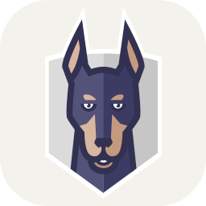      |       `threejs-light`        |         |       `webpack-light`        |         |
|         `apple-dark`         |            |        `caddy-light`         |           |         `databricks`         |       |           `fabric`           |           |        `githubpages`         |      |         `hugo-light`         |            |      `langchain-light`       |   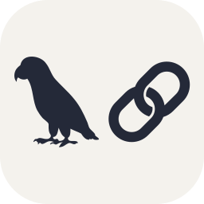    |        `milvus-light`        |          |         `openstack`          |        |        `preact-dark`         |           |        `regex-light`         |           |         `socialite`          |             |        `thunderbird`         |      |          `webstorm`          |         |
|        `apple-light`         |           |           `cairo`            |            |      `databricks-dark`       |       |        `fabric-dark`         |     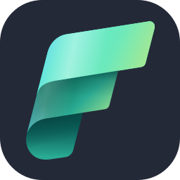      |      `githubpages-dark`      |      |          `hydrogen`          |         |          `laravel`           |          |          `mindsdb`           |          |       `openstack-dark`       |        |        `preact-light`        |          |           `remix`            |            |          `socketio`          |         |      `thunderbird-dark`      |      |       `webstorm-dark`        |         |
|         `apptainer`          |        |         `cairo-dark`         |            |      `databricks-light`      |   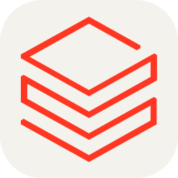   |        `fabric-light`        |          |     `githubpages-light`      |     |       `hydrogen-dark`        |         |        `laravel-dark`        |          |        `mindsdb-dark`        |          |      `openstack-light`       |       |          `prelude`           |               |         `remix-dark`         |            |       `socketio-dark`        |         |     `thunderbird-light`      |     |       `webstorm-light`       |        |
|       `apptainer-dark`       |        |        `cairo-light`         |           |          `datadog`           |               |          `facebook`          |              |         `gitkraken`          |        |       `hydrogen-light`       |        |       `laravel-light`        |         |       `mindsdb-light`        |         |        `openzeppelin`        |     |          `premiere`          |              |        `remix-light`         |           |       `socketio-light`       |        |         `thunkable`          |      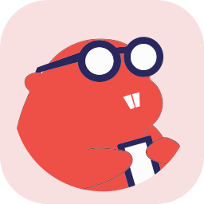       |          `wezterm`           |          |
|      `apptainer-light`       |       |           `canva`            |            |          `datagrip`          |         |           `fastai`           |           |       `gitkraken-dark`       |        |          `hyprland`          |         |        `laravelspark`        |     |            `mint`            |             |     `openzeppelin-dark`      |     |        `premiererush`        |          |           `render`           |           |           `solana`           |           |            `tidb`            |             |        `wezterm-dark`        |          |
|          `appwrite`          |              |         `canva-dark`         |            |       `datagrip-dark`        |         |        `fastai-dark`         |           |      `gitkraken-light`       |       |       `hyprland-dark`        |         |     `laravelspark-dark`      |     |         `mint-dark`          |             |     `openzeppelin-light`     |    |          `primevue`          |    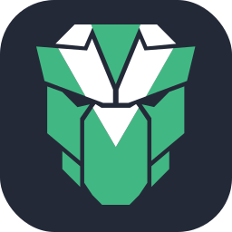     |        `render-dark`         |           |        `solana-dark`         |           |         `tidb-dark`          |             |       `wezterm-light`        |         |
|            `aqua`            |             |        `canva-light`         |           |       `datagrip-light`       |        |        `fastai-light`        |          |           `gitlab`           |           |       `hyprland-light`       |        |     `laravelspark-light`     |    |         `mint-light`         |            |           `opera`            |            |       `primevue-dark`        |    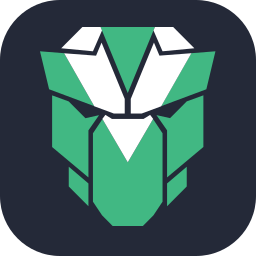     |        `render-light`        |          |        `solana-light`        |          |         `tidb-light`         |            |          `windicss`          |         |
|         `aqua-dark`          |             |         `capacitor`          |        |         `dataspell`          |        |          `fastapi`           |               |        `gitlab-dark`         |           |             `i3`             |               |           `latex`            |            |            `miro`            |                |         `opera-dark`         |            |       `primevue-light`       |    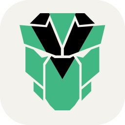    |           `renpy`            |      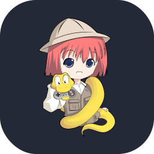      |          `solidity`          |              |            `tmux`            |             |       `windicss-dark`        |         |
|         `aqua-light`         |            |       `capacitor-dark`       |        |       `dataspell-dark`       |        |          `fastlane`          |         |        `gitlab-light`        |          |          `i3-dark`           |               |         `latex-dark`         |            |          `misskey`           |          |        `opera-light`         |           |           `prisma`           |              |         `renpy-dark`         |      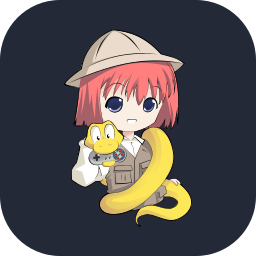      |          `solidjs`           |          |         `tmux-dark`          |             |       `windicss-light`       |        |
|         `arcbrowser`         |       |      `capacitor-light`       |       |      `dataspell-light`       |       |       `fastlane-dark`        |         |           `gleam`            |            |          `i3-light`          |              |        `latex-light`         |           |        `misskey-dark`        |          |           `oracle`           |           |         `processing`         |       |        `renpy-light`         |     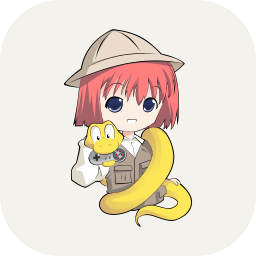      |        `solidjs-dark`        |          |         `tmux-light`         |      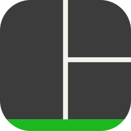      |          `windows`           |          |
|      `arcbrowser-dark`       |       |          `capture`           |               |          `davinci`           |       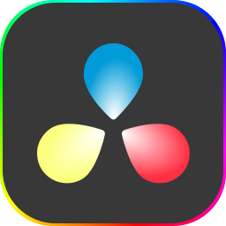        |       `fastlane-light`       |        |         `gleam-dark`         |            |            `iced`            |                |          `lazyvim`           |          |       `misskey-light`        |         |        `oracle-dark`         |     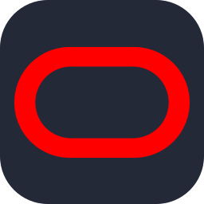      |      `processing-dark`       |       |           `replit`           |           |       `solidjs-light`        |         |           `tomcat`           |           |        `windows-dark`        |          |
|      `arcbrowser-light`      |      |          `cashier`           |               |          `dbeaver`           |          |         `fediverse`          |        |        `gleam-light`         |           |            `idea`            |             |        `lazyvim-dark`        |          |          `mistral`           |          |        `oracle-light`        |     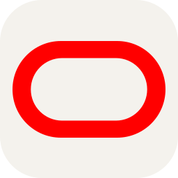     |      `processing-light`      |      |        `replit-dark`         |           |         `sonarqube`          |        |        `tomcat-dark`         |           |       `windows-light`        |         |
|            `arch`            |             |         `cassandra`          |        |        `dbeaver-dark`        |          |       `fediverse-dark`       |        |           `gmail`            |            |         `idea-dark`          |             |       `lazyvim-light`        |         |        `mistral-dark`        |          |           `orchid`           |              |         `prometheus`         |            |        `replit-light`        |          |       `sonarqube-dark`       |        |        `tomcat-light`        |          |         `wireshark`          |        |
|         `arch-dark`          |             |       `cassandra-dark`       |        |       `dbeaver-light`        |         |      `fediverse-light`       |       |         `gmail-dark`         |            |         `idea-light`         |            |          `leaflet`           |     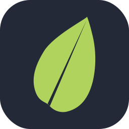     |       `mistral-light`        |         |          `outlook`           |          |          `prompts`           |               |         `resharper`          |        |      `sonarqube-light`       |       |            `tor`             |              |       `wireshark-dark`       |        |
|         `arch-light`         |            |      `cassandra-light`       |       |           `debian`           |              |           `ffmpeg`           |           |        `gmail-light`         |           |           `ignite`           |           |        `leaflet-dark`        |          |            `mjml`            |             |        `outlook-dark`        |          |           `proton`           |           |       `resharper-dark`       |        |           `spark`            |            |          `tor-dark`          |              |      `wireshark-light`       |       |
|           `arcjet`           |           |         `chainlink`          |        |           `defold`           |           |        `ffmpeg-dark`         |           |           `gnome`            |            |        `ignite-dark`         |           |       `leaflet-light`        |         |         `mjml-dark`          |             |       `outlook-light`        |         |        `proton-dark`         |           |      `resharper-light`       |       |         `spark-dark`         |            |         `tor-light`          |             |            `word`            |             |
|        `arcjet-dark`         |           |       `chainlink-dark`       |        |        `defold-dark`         |           |        `ffmpeg-light`        |          |         `gnome-dark`         |            |        `ignite-light`        |          |          `leetcode`          |         |         `mjml-light`         |            |            `p5js`            |                |        `proton-light`        |          |           `reverb`           |              |        `spark-light`         |           |            `trpc`            |                |         `word-dark`          |             |
|        `arcjet-light`        |          |      `chainlink-light`       |       |        `defold-light`        |          |           `fiber`            |            |        `gnome-light`         |           |        `illustrator`         |           |       `leetcode-dark`        |         |            `ml5`             |              |            `pail`            |             |          `proxmox`           |          |           `revolt`           |           |           `spring`           |           |          `truffle`           |          |         `word-light`         |            |
|          `arduino`           |               |     `characteranimator`      |     |            `deno`            |             |         `fiber-dark`         |            |           `godot`            |            |           `incopy`           |              |       `leetcode-light`       |        |          `ml5-dark`          |              |         `pail-dark`          |             |        `proxmox-dark`        |          |        `revolt-dark`         |           |        `spring-dark`         |           |        `truffle-dark`        |          |         `wordpress`          |             |
|           `argocd`           |           |          `chartjs`           |          |         `deno-dark`          |             |        `fiber-light`         |           |         `godot-dark`         |            |          `indesign`          |              |            `less`            |             |         `ml5-light`          |             |         `pail-light`         |            |       `proxmox-light`        |         |        `revolt-light`        |          |        `spring-light`        |          |       `truffle-light`        |         |          `workers`           |          |
|        `argocd-dark`         |           |        `chartjs-dark`        |          |         `deno-light`         |            |           `figma`            |            |        `godot-light`         |           |          `inertia`           |               |         `less-dark`          |             |           `mocha`            |            |           `pandas`           |           |            `pug`             |              |           `rider`            |            |         `sqlalchemy`         |       |            `twig`            |             |        `workers-dark`        |          |
|        `argocd-light`        |          |       `chartjs-light`        |         |           `desmos`           |              |         `figma-dark`         |            |           `goland`           |           |           `infura`           |              |         `less-light`         |            |         `mocha-dark`         |            |        `pandas-dark`         |           |          `pug-dark`          |              |         `rider-dark`         |            |      `sqlalchemy-dark`       |       |         `twig-dark`          |             |       `workers-light`        |         |
|          `assembly`          |              |          `chatgpt`           |          |           `devto`            |            |        `figma-light`         |           |        `goland-dark`         |           |          `inkscape`          |         |           `libsql`           |              |        `mocha-light`         |           |        `pandas-light`        |          |         `pug-light`          |             |        `rider-light`         |           |      `sqlalchemy-light`      |      |         `twig-light`         |      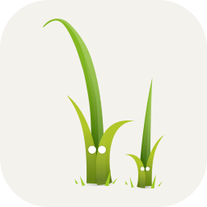      |            `wsl`             |              |
|           `astro`            |                 |        `chatgpt-dark`        |          |         `devto-dark`         |            |          `filament`          |              |        `goland-light`        |          |       `inkscape-dark`        |         |         `lighthouse`         |            |            `mojo`            |             |         `papertrail`         |            |           `pulse`            |            |        `robloxstudio`        |          |           `sqlite`           |              |           `twitch`           |              |          `wsl-dark`          |              |
|            `atom`            |                |       `chatgpt-light`        |         |        `devto-light`         |           |          `firebase`          |         |           `golang`           |              |       `inkscape-light`       |        |         `lightning`          |        |         `mojo-dark`          |             |          `payload`           |          |         `pulse-dark`         |            |           `rocket`           |              |         `sqlserver`          |        |          `typeorm`           |          |         `wsl-light`          |             |
|          `audition`          |              |           `chrome`           |           |        `digitalocean`        |  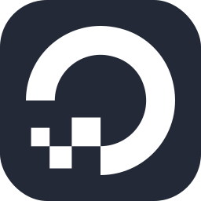   |       `firebase-dark`        |         |      `googleanalytics`       |  |          `insomnia`          |              |       `lightning-dark`       |        |         `mojo-light`         |            |        `payload-dark`        |          |        `pulse-light`         |           |          `rollupjs`          |         |       `sqlserver-dark`       |        |        `typeorm-dark`        |          |             `x`              |              |
|           `authjs`           |           |        `chrome-dark`         |           |     `digitalocean-dark`      |     |       `firebase-light`       |        |    `googleanalytics-dark`    |  |         `instagram`          |             |      `lightning-light`       |       |          `mongodb`           |               |       `payload-light`        |         |         `puppeteer`          |        |       `rollupjs-dark`        |         |      `sqlserver-light`       |       |       `typeorm-light`        |         |           `x-dark`           |              |
|        `authjs-dark`         |           |        `chrome-light`        |          |     `digitalocean-light`     |    |          `firefox`           |          |   `googleanalytics-light`    | |        `integrations`        |     |         `lightroom`          |             |          `mongoose`          |              |            `pbi`             |              |       `puppeteer-dark`       |        |       `rollupjs-light`       |        |       `stackoverflow`        |    |         `typescript`         |            |          `x-light`           |               |
|        `authjs-light`        |          |          `chromium`          |         |         `dimension`          |             |        `firefox-dark`        |          |      `googleappsscript`      | |     `integrations-dark`      |     |      `lightroomclassic`      |      |           `mysql`            |            |          `pbi-dark`          |              |      `puppeteer-light`       |       |            `ros`             |              |     `stackoverflow-dark`     |    |           `ubuntu`           |              |           `xcode`            |            |
|          `autocad`           |          |       `chromium-dark`        |         |          `directus`          |              |       `firefox-light`        |         |   `googleappsscript-dark`    | |     `integrations-light`     |    |          `linkedin`          |              |         `mysql-dark`         |            |         `pbi-light`          |             |          `pycharm`           |          |          `ros-dark`          |              |    `stackoverflow-light`     |   |           `unity`            |            |         `xcode-dark`         |            |
|        `autocad-dark`        |          |       `chromium-light`       |        |          `discord`           |               |         `flameshot`          |             |   `googleappsscript-light`   ||            `ipfs`            |             |           `linux`            |            |        `mysql-light`         |           |          `pennant`           |               |        `pycharm-dark`        |          |         `ros-light`          |             |           `steam`            |                 |         `unity-dark`         |            |        `xcode-light`         |           |
|       `autocad-light`        |         |          `circleci`          |         |        `discordbots`         |           |           `flask`            |            |           `gradle`           |           |         `ipfs-dark`          |             |         `linux-dark`         |            |           `neovim`           |           |            `perl`            |                |       `pycharm-light`        |         |          `rubocop`           |          |           `stock`            |                 |        `unity-light`         |           |             `xd`             |                  |
|         `avaloniaui`         |            |       `circleci-dark`        |         |         `discordjs`          |        |         `flask-dark`         |            |        `gradle-dark`         |           |         `ipfs-light`         |            |        `linux-light`         |           |        `neovim-dark`         |           |         `photoshop`          |             |           `pygame`           |           |        `rubocop-dark`        |          |         `storyblok`          |        |        `unitycatalog`        |     |            `yaml`            |             |
|            `aws`             |              |       `circleci-light`       |        |       `discordjs-dark`       |        |        `flask-light`         |           |        `gradle-light`        |          |           `jamovi`           |              |            `lit`             |              |        `neovim-light`        |          |      `photoshopclassic`      |      |        `pygame-dark`         |           |       `rubocop-light`        |         |       `storyblok-dark`       |        |     `unitycatalog-dark`      |     |         `yaml-dark`          |             |
|          `aws-dark`          |              |           `claude`           |           |      `discordjs-light`       |       |           `fleet`            |            |          `grafana`           |          |            `java`            |             |          `lit-dark`          |              |           `nestjs`           |           |      `photoshopexpress`      |      |        `pygame-light`        |          |            `ruby`            |                |      `storyblok-light`       |       |     `unitycatalog-light`     |    |         `yaml-light`         |            |
|         `aws-light`          |             |        `claude-dark`         |           |           `django`           |              |         `fleet-dark`         |            |        `grafana-dark`        |          |         `java-dark`          |             |         `lit-light`          |             |        `nestjs-dark`         |           |            `php`             |              |           `python`           |           |          `rubymine`          |         |         `storybook`          |        |           `unocss`           |           |           `yammer`           |           |
|            `azul`            |                |        `claude-light`        |     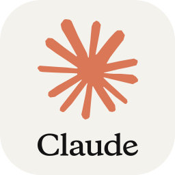     |           `docker`           |              |        `fleet-light`         |           |       `grafana-light`        |         |         `java-light`         |            |           `litmus`           |           |        `nestjs-light`        |          |          `php-dark`          |              |        `python-dark`         |           |       `rubymine-dark`        |         |       `storybook-dark`       |        |        `unocss-dark`         |           |        `yammer-dark`         |           |
|           `azure`            |            |           `clerk`            |                 |          `docksal`           |          |          `flutter`           |          |           `grails`           |              |         `javascript`         |            |        `litmus-dark`         |           |          `netlify`           |          |         `php-light`          |             |        `python-light`        |          |       `rubymine-light`       |        |      `storybook-light`       |       |        `unocss-light`        |          |        `yammer-light`        |          |
|         `azure-dark`         |            |           `clion`            |            |        `docksal-dark`        |          |        `flutter-dark`        |          |          `graphql`           |          |            `jax`             |              |        `litmus-light`        |          |        `netlify-dark`        |          |          `phpstan`           |          |          `pytorch`           |          |            `rust`            |             |           `strapi`           |              |        `unrealengine`        |          |            `yarn`            |             |
|        `azure-light`         |           |         `clion-dark`         |            |       `docksal-light`        |    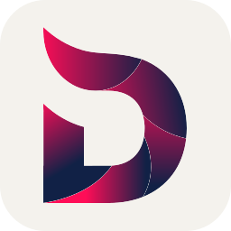     |       `flutter-light`        |         |        `graphql-dark`        |          |          `jax-dark`          |       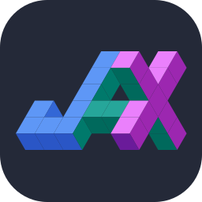       |          `livewire`          |         |       `netlify-light`        |         |        `phpstan-dark`        |          |        `pytorch-dark`        |          |         `rust-dark`          |             |         `streamlit`          |        |             `v`              |              |         `yarn-dark`          |             |
|        `azuredevops`         |      |        `clion-light`         |           |          `docsify`           |          |        `flutterflow`         |      |       `graphql-light`        |         |         `jax-light`          |      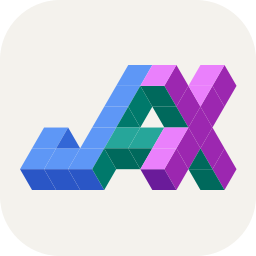       |       `livewire-dark`        |         |           `nextjs`           |           |       `phpstan-light`        |         |       `pytorch-light`        |         |         `rust-light`         |            |       `streamlit-dark`       |        |           `v-dark`           |              |         `yarn-light`         |            |
|      `azuredevops-dark`      |      |          `clojure`           |          |        `docsify-dark`        |          |      `flutterflow-dark`      |      |          `gromacs`           |          |           `jekyll`           |           |       `livewire-light`       |        |        `nextjs-dark`         |           |          `phpstorm`          |         |           `pyxel`            |            |         `rustrover`          |        |      `streamlit-light`       |       |          `v-light`           |               |            `yew`             |              |
|     `azuredevops-light`      |     |        `clojure-dark`        |          |       `docsify-light`        |         |     `flutterflow-light`      |     |        `gromacs-dark`        |          |        `jekyll-dark`         |           |         `llamaindex`         |       |        `nextjs-light`        |          |       `phpstorm-dark`        |         |         `pyxel-dark`         |            |       `rustrover-dark`       |        |           `stripe`           |           |          `vagrant`           |          |          `yew-dark`          |              |
|           `babel`            |                 |       `clojure-light`        |         |           `dotnet`           |              |           `flyio`            |                 |       `gromacs-light`        |         |        `jekyll-light`        |          |      `llamaindex-dark`       |       |           `nginx`            |                 |       `phpstorm-light`       |        |        `pyxel-light`         |           |      `rustrover-light`       |       |        `stripe-dark`         |           |        `vagrant-dark`        |          |         `yew-light`          |             |
|          `barbajs`           |       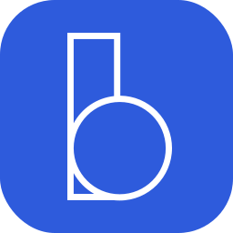        |         `cloudflare`         |       |        `dreamweaver`         |           |           `fonts`            |                 |            `grpc`            |             |          `jenkins`           |          |      `llamaindex-light`      |      |           `ngrok`            |                 |          `picocss`           |          |           `qdrant`           |           |             `s3`             |               |        `stripe-light`        |          |       `vagrant-light`        |         |            `yii`             |              |
|            `bash`            |             |      `cloudflare-dark`       |       |          `drizzle`           |          |           `forge`            |                 |         `grpc-dark`          |             |        `jenkins-dark`        |          |           `logto`            |            |            `nim`             |       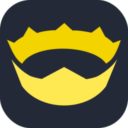       |        `picocss-dark`        |          |        `qdrant-dark`         |           |          `s3-dark`           |               |      `styledcomponents`      |      |            `vala`            |                |          `yii-dark`          |              |

# 💖 Support the Project
Thank you so much already for using my projects!
To support the project directly, feel free to open issues for icon suggestions, or contribute with a pull request!
